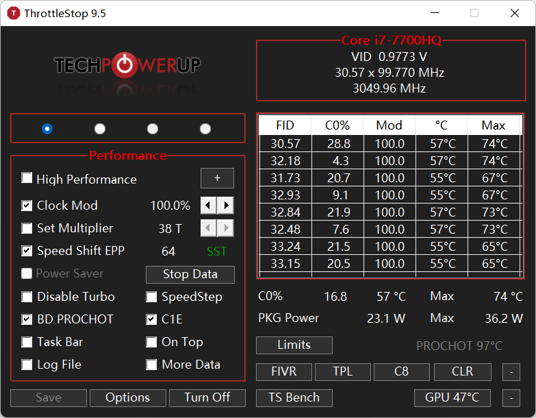

# [尚未完成] ThrottleStop 使用指南

**警告：超频有风险，超频时的不当操作可能会导致死机、蓝屏，严重可能会导致部件虚焊、烧毁，请考虑好再超频，超频造成的一切后果本人概不负责。**

**提示：本文使用的是ThrottleStop 9.5版本，可能与老版本界面布局不一致。**

## 首次下载安装

[ThrottleStop下载](https://www.techpowerup.com/download/techpowerup-throttlestop/)

下载完解压到一个文件夹，双击ThrottleStop.exe启动。

运行时会生成一个ThrottleStop.ini文件，它是该程序的配置文件。

如果在超频时出现问题，或者想恢复原始设置，您可以尝试重命名或删除ThrottleStop.ini文件。

## 主界面

主界面可以简单看作左右两栏，我将从左栏 从上往下介绍：

### 主界面 - 左侧

| 界面元素           | 功能                                               | 说明                                                                                                                                                                                                                                            |
| ------------------ | -------------------------------------------------- | ----------------------------------------------------------------------------------------------------------------------------------------------------------------------------------------------------------------------------------------------- |
| ◉  ◯  ◯  ◯  | 性能配置文件                                       | 用于在不同的使用场景中快速切换配置。                                                                                                                                                                                                            |
| ▢High Performance | 电源计划                                           | 选中后启用对应的Windows的电源计划。 * 自定义电源计划因中文名称会乱码。所以不要点右边的加号                                                                                                                                                 |
| ▢Clock Mod        | 时钟频率                                           | 使CPU或芯片组以百分比频率运行。 * 非必要，一般用于降频省电                                                                                                                                                                                 |
| ▢Set Multiplier   | CPU倍频                                            | 老旧功能，调整CPU倍频，在[SST](#术语)启用时不可用。 * 在启用SST时应该去FIVR -> Turbo Ratio Limits调整                                                                                                                                         |
| ▢Speed Shift EPP  | [Speed Shift Technology (SST)](#术语)  变速技术 | 右侧数字可以修改为 0-255 之间的值，其中 0 表示首选最高频率运行（受其他因素限制，如禁用睿频），255 表示首选以最低频率运行。 注意：某些主板需要在Bios中启用。启用“Speed Shift”后，右侧会显示绿色的SST字样。 * 启用时无法设置CPU倍频。 |
| ▢Power Saver      | 节能: 降频                                         | 仅当禁用睿频时可用，启用后会使CPU空闲时的时钟频率降至最低                                                                                                                                                                                       |
| ▢Disable Turbo    | 禁用睿频                                           | 选中时将禁用 CPU 的睿频。在限制功耗和温度的时候非常管用。                                                                                                                                                                                       |
| ▢BD PROCHOT       | 温度墙                                             | 100 或 105C时触发的紧急限制，降低倍频防止电脑过热烧毁，一般不建议禁用。                                                                                                                                                                         |
| ▢C1E              | C1 enhanced state 节能: C1增强状态            | 当您的PC低负载时，它会降低频率和电压，从而减少功耗和热量。 * 某些网站声称关闭此选项能略微提高CPU和SSD的性能                                                                                                                                |
| ▢Task Bar         | 缩小到任务栏                                       | 缩小到任务栏，而不是隐藏到任务栏图标。                                                                                                                                                                                                          |
| ▢Log File         | 启用日志文件                                       | 将运行日志写入到文件中，以便于在日志中分析性能限制因素。                                                                                                                                                                                        |
| ▢More Data        | 更多数据                                           | 更快的数据采样。                                                                                                                                                                                                                                |

### 主界面 - 右侧

...

## 术语

1. SST - Speed Shift Technology - SpeedStep® 技术：允许系统动态调整处理器电压和内核频率，从而降低平均功耗和热量产生。

## 参考文献

1. [ThrottleStop Guide](https://www.ultrabookreview.com/31385-the-throttlestop-guide/)
2. [What does Intel Speed Shift do?](https://forums.tomshardware.com/threads/what-does-intel-speed-shift-do.3574107/)
3. [What is &#34;C1E support&#34; on my AMD CPU?](https://superuser.com/questions/184569/what-is-c1e-support-on-my-amd-cpu)
